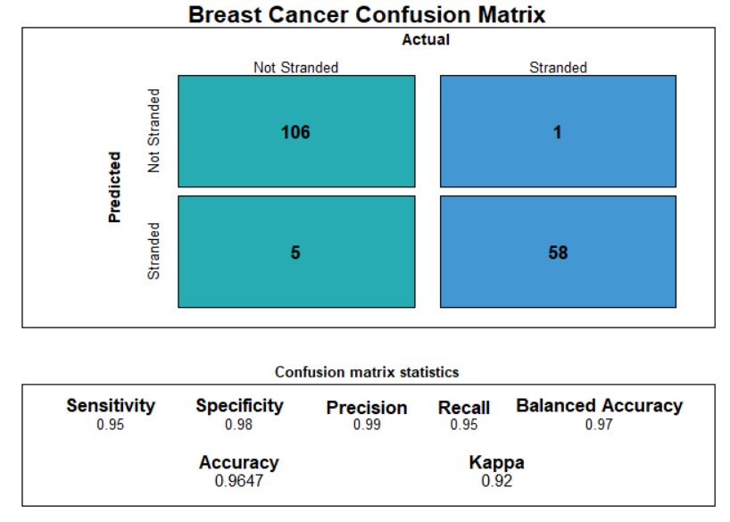

# ConfusionTableR - a package to tidy confusion matrix outputs for record level storage

<p><a href="https://hutsons-hacks.info/"></a></p>

 <!-- badges: start -->
  [](https://github.com/StatsGary/ConfusionTableR/actions)
  [](https://cran.r-project.org/package=ConfusionTableR)
   [](https://CRAN.R-project.org/package=ConfusionTableR) 
  
  
  [](https://cran.r-project.org/package=ConfusionTableR)
  <!-- badges: end -->

This package was spurred from the motivation of storing confusion matrix outputs in a database, or data frame, in a row by row format, as we have to test many machine learning models and it is useful in storing the structures in a database. 

## Installing the package from GitHub

Here, I will use the package remotes to install the package:

``` r
# install.packages("remotes") # if not already installed
remotes::install_github("https://github.com/StatsGary/ConfusionTableR")
library(ConfusionTableR)

```
## Installing the package from CRAN

To install from CRAN, use the below command:
``` r
install.packages("ConfusionTableR")

```

## Loading the package

To load the package:
``` r
library(ConfusionTableR)

```

## Using the package

This will download the package and now you can start to use the package with the ML outputs. The supporting Vignette will give the example usage and how to get the most out of the package. 

I found this package to be really useful, as I frequently work with confusion matrices on the back of the CARET library - developed by [`Max Kuhn`](https://cran.r-project.org/web/packages/caret/caret.pdf) and his team. 

The package aim is to make it easier to convert the outputs of the lists from caret and collapse these down into row-by-row entries, specifically designed for storing the outputs in a database or row by row data frame. 

## Vignette

The vignette on how to use the package is available <a href="https://rpubs.com/StatsGary/ConfusionTableR">here</a>.

## Package contents

The package contains three main functions for dealing with binary and multi-class prediction problems, and allows for row level views to be built. The package contents are:

- `binary_visualiseR` - this function allows you to create a nice looking visual on the back of a binary classification task. 
- `binary_class_cm` - this is used for binary classification tasks only and the object passed must be a caret confusion matrix object and class
- `multi_class_cm` - this is used for multi-classification tasks only. Refer to the vignette for guidance.

Example of binary_visualiseR output:

<p></p>

Read the linked <a href="https://rpubs.com/StatsGary/ConfusionTableR">vignette</a> for the full implementation of how to use the package. 

## New Additions

The new addition to the ConfusionTableR package is that a dummy encoding function has been added to encode multiple columns across a data frame, as currently most encoding options have only one column at a time potential. 


## Closing remarks

It has been fun putting this package together and I hope you find it useful. If you find any issues using the package, please raise a git hub ticket and I will address it as soon as possible. 
